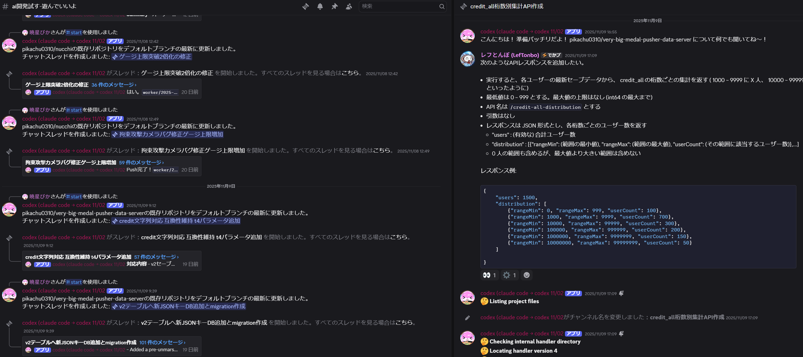

# Discord Codex Bot



> 「Gitリポジトリをクローンして、Discord スレッド上から Codex Code を操作する」ためのオールインワン Bot。  
> `/start owner/repo` と書くだけで、Bot がローカルにクローンし、実行ログを逐次スレッドへ流しながらコマンドをこなします。

---

## Quick Start: 触ってイメージを掴む

1. Bot を招待したサーバーで `/start pikachu0310/discord-codex-bot` のように GitHub リポジトリを指定して実行します。  
   オートコンプリートが効くので `owner/repo` の入力も簡単です。
2. Bot は専用スレッドを作成し、バックエンドでリポジトリをクローン → Codex CLI に接続。  
   実行したコマンドや標準出力は 1,500 文字単位で分割され、Discord にすべて投稿されます。
3. あとは通常のチャットのように「README を改善して」「テストを追加して」など指示すると Codex が対応します。

```text
/start pikachu0310/discord-codex-bot
Bot: ✅ スレッドを作成しました。Codex が環境を準備しています...
ユーザー: 型定義まわりを整理して
Bot: ⚡ Bash: git status --short
     ✅ ツール実行結果 (抜粋)
     ...（出力が続く）...
ユーザー: /stop
Bot: ⛔ Codex Code の実行を中断しました。新しい指示を書いて再開できます。
```

Bot はレート制限に達しても自動で待機・再開し、スレッドを離れても状態を保持するので安心です。

---

## 主な機能

- **Codex CLI 連携**  
  Codex Code のストリーミング結果を Discord にリアルタイム反映。コマンド、標準出力、実行結果を余さず報告します。
- **マルチリポジトリ対応**  
  `/start owner/repo` でリポジトリをクローンし、Worktree ベースの隔離環境で作業。複数スレッドを並列管理できます。
- **Dev Container 実行**  
  `devcontainer.json` を検知するとワンクリックでコンテナを起動し、その中で Codex を実行（ホスト fallback も可）。
- **レート制限と再開**  
  Codex のレート制限を検出し、自動でクールダウン → 再実行。必要なら自動再開用の進捗メッセージも送信します。
- **翻訳とスレッド名生成**  
  PLaMo 翻訳で日本語指示を自動英訳し、Gemini API を使って最初の指示からスレッド名を要約生成します。
- **GitHub PAT 管理**  
  Fine-grained PAT を Discord から登録・削除できます（プライベートリポジトリでも安全にクローン）。
- **永続化と監査**  
  セッションログ、スレッド状態、監査ログを JSON/JSONL で保存。Bot 再起動後も途中の作業を復元します。
- **詳細な進捗ログ**  
  Bash/Write など各ツールの出力をコードブロックで整形。エラーも含めて全文をチャットに流します。
- **柔軟なモード切替**  
  `/plan` で Codex のプランモードを ON/OFF、`/stop` で実行中ジョブを即座に中断。

---

## Discord での操作フロー

1. **スレッド開始** – `/start owner/repo`  
   指定リポジトリをクローンしスレッドを作成。初回は `main` をチェックアウトし、必要な場合は worktree を生成します。
2. **作業指示** – スレッド内で自然言語/コマンドを送信  
   進捗は数秒ごとに流れ、最後の応答はスレッド内の返信としてまとまって届きます。
3. **必要に応じて自動翻訳** – 日本語 → 英語（PLaMo）  
   英語での Codex 精度を高めるためにバックグラウンドで翻訳。失敗した場合はオリジナルをそのまま使用します。
4. **結果の確認** – コマンド結果や差分は全て Discord 側に投稿  
   長文は 1,500 文字単位で分割されるので、モバイルでも読みやすいです。
5. **作業の切り替え** – `/plan`, `/stop`, `/close`  
   必要に応じてモード変更やスレッドクローズが可能。`/close` は ManageThreads 権限が必要です。

---

## インストール & セットアップ

### 前提コマンド

| 種別 | コマンド | 用途 |
| ---- | -------- | ---- |
| 必須 | [Deno](https://deno.land/) >= 1.40 | 実行/ビルド環境 |
| 必須 | [git](https://git-scm.com/) | リポジトリクローン & worktree |
| 必須 | [codex](https://docs.anthropic.com/en/docs/codex-code) | Codex CLI 本体 |
| 推奨 | [gh](https://cli.github.com/) | リポジトリオートコンプリート & PAT 連携 |
| 推奨 | [devcontainer](https://github.com/devcontainers/cli) | Dev Container 実行 |
| 推奨 | [`script`](https://man7.org/linux/man-pages/man1/script.1.html) | TTY が必要な環境でのフォールバック |

Bot 起動時に自動でシステムチェックが走り、必須コマンドが足りない場合はエラーと解決策を提示します。

### セットアップ手順

```bash
git clone https://github.com/your-org/discord-codex-bot.git
cd discord-codex-bot

# 例: 環境変数テンプレート
cp .env.example .env
$EDITOR .env
```

`.env` では最低限 `DISCORD_TOKEN` と `WORK_BASE_DIR` を設定します。`WORK_BASE_DIR` は Bot がクローンやログを保存するベースディレクトリです。

Discord 側では [Developer Portal](https://discord.com/developers/applications) でアプリケーションを作成、Bot トークンを取得し、以下の権限を付与してサーバーへ招待してください。

- Send Messages / Send Messages in Threads / Read Message History
- Create Public Threads
- Use Slash Commands

最後に起動します:

```bash
# 開発モード（ウォッチ + ログ多め）
deno task dev

# 本番モード（シンプルなログ）
deno task start
```

Git hooks を使う場合は `deno task setup-hooks` を実行してください。

---

## 環境変数

| 変数名 | 必須 | 説明 |
| ------ | ---- | ---- |
| `DISCORD_TOKEN` | ✅ | Discord Bot トークン |
| `WORK_BASE_DIR` | ✅ | 作業ディレクトリのルート。`repositories/`, `threads/` などが作成されます |
| `CODEX_APPEND_SYSTEM_PROMPT` | ❌ | Codex CLI の `--append-system-prompt` に渡す追記文 |
| `CODEX_CODE_MAX_OUTPUT_TOKENS` | ❌ | Codex CLI の最大出力トークン（デフォルト 25,000） |
| `CODEX_CLI_OUTPUT_FORMAT_MODE` | ❌ | `auto` / `never` / `always`。`--output-format` フラグの扱い |
| `GEMINI_API_KEY` | ❌ | スレッド名自動要約のための Gemini API キー |
| `PLAMO_TRANSLATOR_URL` | ❌ | PLaMo-2-translate のエンドポイント URL |
| `VERBOSE` | ❌ | `true` で詳細ログ（実行コマンド、環境情報など）を標準出力に表示 |

`CODEX_CLI_OUTPUT_FORMAT_MODE=auto` の場合、起動時に `codex --help` を解析してフラグ対応状況を自動判定します。

---

## データ永続化とディレクトリ構成

```text
WORK_BASE_DIR/
├── repositories/{org}/{repo}/      # オリジナルリポジトリのクローン
├── threads/{thread_id}.json        # スレッドメタ情報
├── sessions/{thread_id}/{session}.jsonl  # Codex セッションの JSONL ログ
├── worktrees/{thread_id}/...       # Worker ごとの隔離された作業コピー
├── pats/{owner}/{repo}.json        # 保存された GitHub PAT（一部暗号化）
├── audit/{yyyy-mm-dd}/activity.jsonl # ハイレベルな監査ログ
└── queued_messages/{thread_id}.json    # レート制限中に蓄積したメッセージ
```

Bot を停止しても、これらのファイルから状態を再構築できるため、再起動後に自動でスレッドが復旧します。

---

## Discord スラッシュコマンド

| コマンド | 説明 |
| -------- | ---- |
| `/start <repository>` | 新しい作業スレッドを作成し、Codex Worker を起動します。 |
| `/set-pat <repository> <token>` | プライベートリポジトリ用の GitHub Fine-grained PAT を登録します。 |
| `/list-pats` | 保存済み PAT の一覧を確認します（トークン文字列自体はマスクされます）。 |
| `/delete-pat <repository>` | 指定リポジトリ用に保存した PAT を削除します。 |
| `/stop` | 実行中の Codex Code を安全に中断します。 |
| `/plan` | Codex のプランモードをトグルします（実行前に計画フェーズを強制できます）。 |
| `/close` | 現在のスレッドをクローズしてアーカイブします（Manage Threads 権限が必要）。 |

Bot からの通常メッセージ以外にも、再開時の自動メッセージや進捗投稿で「何をしているか」が常に確認できます。

---

## アーキテクチャ概要

本プロジェクトは大きく **Admin**, **Worker**, **WorkspaceManager** の 3 つのコンポーネントで構成されています。

### Admin
- プロセス内に 1 つだけ常駐し、Discord クライアントを保持します。
- `/start` を受け取ると新しい Worker を生成し、スレッド作成・初期メッセージの送信を行います。
- スレッド内のユーザーメッセージを受け取り、対応する Worker に委譲します。
- RateLimitManager、DevcontainerManager、WorkerManager と連携し、再開処理や監査ログの記録も担当します。

### Worker
- 各スレッドに 1 対 1 で紐づき、Codex CLI を実行する責務を持ちます。
- Codex のストリーミング出力を `CodexStreamProcessor` で解析し、Discord 向けに整形した更新を送信。
- Bash や Write などのツール結果をコードブロック化し、長文はチャンク化して Discord に配信します。
- PLaMo Translator で翻訳、Gemini で要約、SessionLogger で JSONL の生ログ保存など周辺機能も内包しています。

### WorkspaceManager
- すべての永続化を統括するコンポーネント。
- リポジトリクローン、Worktree 作成、スレッド情報の保存／読込、セッションログ・監査ログ・PAT 管理などを担います。
- 失敗しても安全なように JSON スキーマ検証や一時ファイルを活用。

---

## Codex 実行の流れ

1. Worker がユーザー指示を受け取り、必要なら翻訳。
2. `codex` CLI をサブプロセスとして起動し、ストリームを 1 行ずつ解析。
3. Bash 実行などのツールメッセージを検出して即座に Discord に投稿。
4. 最後の応答 (`turn.completed` / `response.completed`) は進捗投稿を抑制し、メインの返信としてまとめて返却。
5. 使用トークン数をレートリミットマネージャーに記録し、必要なら再開キューに入れる。
6. 生の JSONL は `sessions/` ディレクトリに保存され、後からローカルで再解析できます。

---

## GitHub リポジトリの取り扱い

- **Worktree ベースの隔離環境**  
  元のクローンをキャッシュしつつ、スレッドごとに worktree を作成。変更は各スレッド専用のブランチに反映されるので干渉しません。
- **PAT 管理**  
  Fine-grained PAT を Discord 上で登録すると、`pats/{repo}.json` に暗号化保存され、クローンや fetch に利用されます。
- **Dev Container 実行**  
  `devcontainer.json` と CLI が揃っている場合、ボタン 1 つで devcontainer を起動。ログは Discord にストリームされます。失敗した場合は自動でホスト実行にフォールバック。
- **レート制限と再開**  
  GitHub API や Codex レート制限を検出すると、Admin がメッセージをキューに詰め、制限解除後に自動処理します。

---

## 開発者向け

```bash
# 依存関係のキャッシュ
deno cache src/main.ts

# 一括チェック
deno task fmt
deno task lint
deno task check
deno task test

# quiet モード（CI 用）
deno task fmt:quiet
deno task lint:quiet
deno task check:quiet
deno task test:quiet
deno task test:all:quiet
```

テストは Codex CLI をモックしながら Worker のストリーム処理・メッセージフォーマット・翻訳などをカバーしています。`test/` 配下の統合テストや `src/worker_*_test.ts` を参照してください。

---

## トラブルシューティング

- **`codex` コマンドが見つからない**  
  PATH に Codex CLI を追加し、`codex --version` が通ることを確認してください。Bot 起動時のシステムチェックにも表示されます。
- **`stdout is not a terminal` が発生する**  
  `script` コマンド（util-linux）をインストールすると、自動で擬似 TTY を使うフォールバックが有効になります。
- **Dev Container の起動に失敗する**  
  Discord 上で失敗ログが流れたあと自動でホスト実行に切り替わります。`deno task dev` のログも併せて確認してください。
- **プライベートリポジトリがクローンできない**  
  `/set-pat owner/repo <token>` を実行して Fine-grained PAT を登録します。`/list-pats` で登録状況を確認できます。
- **Codex のレート制限にかかった**  
  Bot が自動でメッセージをキューに入れて再開します。急ぐ場合は `/stop` で中断し、しばらく待ってから指示を送ってください。

---

## ライセンス / クレジット

このリポジトリは Discord 上から Codex Code を最大限活用するために設計されています。フォークや再配布時は、スクリーンショット画像（`docs/images/discord-codex-overview.png`）を好みのものに差し替えてください。
# 全テスト実行
deno test --allow-read --allow-write --allow-env --allow-run

# 特定のテストファイルを実行
deno test --allow-read --allow-write --allow-env --allow-run src/worker_test.ts
```

### デバッグ

1. 開発モードで起動

```bash
deno task dev
```

2. ログの確認

- 標準出力にログが表示されます
- 監査ログ: `WORK_BASE_DIR/audit/{date}/activity.jsonl`
- セッションログ: `WORK_BASE_DIR/sessions/{thread_id}/{session_id}.json`

## アーキテクチャ

### システム概要

Discord
BotはAdmin-Worker型のマルチプロセスアーキテクチャを採用しています。1つのAdminプロセスが複数のWorkerを管理し、各Workerが1つのDiscordスレッドを担当します。

### 主要コンポーネント

#### Admin (`src/admin.ts`) - 1748行

プロセス全体で1つだけ起動される管理モジュール。

- **Worker管理**: スレッドごとにWorkerインスタンスを作成・管理
- **メッセージルーティング**: スレッドIDに基づいてメッセージを適切なWorkerに転送
- **レート制限管理**: Codex APIのレート制限を検出し、自動再開タイマーを管理
- **Devcontainer対応**: リポジトリのdevcontainer.jsonを検出し、実行環境を選択
- **状態永続化**: アプリケーション再起動後のスレッド復旧機能

#### Worker (`src/worker.ts`) - 1667行

各スレッドに1対1で対応する実行モジュール。

- **Codex CLI実行**: ホスト環境またはDevcontainer環境でCodex CLIを実行
- **ストリーミング処理**: JSON Lines形式でCodexの出力をリアルタイム処理
- **メッセージフォーマット**: ツール使用の可視化、長文要約、TODOリストの特別処理
- **翻訳機能統合**: PLaMo-2-translateによる日本語→英語翻訳（オプション）
- **セッションログ記録**: 全てのやり取りを永続化

#### WorkspaceManager (`src/workspace.ts`) - 636行

作業ディレクトリとデータ永続化を一元管理。

- **11種類のディレクトリ管理**:
  repositories、threads、sessions、audit、worktrees等
- **データ永続化**:
  スレッド情報、セッションログ、監査ログ、PAT情報などをJSON形式で保存
- **Worktree管理**: Git worktreeのコピー作成・削除による独立した作業環境
- **メッセージキュー**: レート制限時のメッセージ保存と処理

#### ユーティリティモジュール

- **GitUtils** (`src/git-utils.ts`): GitとGitHub CLIを使用したリポジトリ操作
- **DevContainer** (`src/devcontainer.ts`): Dev Container
  CLIとの連携、ストリーミングログ処理
- **Gemini** (`src/gemini.ts`): Google Gemini APIによるスレッド名自動生成
- **PLaMoTranslator** (`src/plamo-translator.ts`):
  コーディング指示に特化した日本語→英語翻訳

### メッセージ処理フロー

```text
Discord User
    ↓
main.ts (MessageCreate Event)
    ↓
admin.routeMessage()
    ├─ レート制限チェック → キューイング
    └─ Worker検索
          ↓
worker.processMessage()
    ├─ PLaMo翻訳（オプション）
    └─ Codex CLI実行（ストリーミング）
          ↓
メッセージタイプ別処理
    ├─ assistant: フォーマット処理
    ├─ tool_use: アイコン付き表示
    ├─ tool_result: スマート要約
    └─ error: エラーハンドリング
          ↓
Discord送信（2000文字制限対応）
```

### Dev Container統合

リポジトリにdevcontainer.jsonが存在する場合：

1. Dev Container CLIの可用性チェック
2. Anthropics features（Codex Code）の検出
3. ユーザー選択によるDevcontainer起動
4. コンテナ内でのCodex実行

### 状態管理と永続化

- **スレッド情報**: 作成時刻、最終アクティブ時刻、リポジトリ情報、ステータス
- **セッションログ**: Codexとのやり取りを時系列でJSONL形式記録
- **監査ログ**: システムアクションの追跡（Worker作成、メッセージ受信等）
- **再起動対応**: AdminState/WorkerStateによる状態復旧

## トラブルシューティング

### Botが応答しない

- Discord Tokenが正しく設定されているか確認
- Botに必要な権限があるか確認
- ログでエラーメッセージを確認

### Codex CLIエラー

- Codex CLIがインストールされているか確認: `codex --version`
- Codex APIキーが設定されているか確認

### リポジトリクローンエラー

- プライベートリポジトリの場合、GitHub CLIがインストールされ認証済みか確認:
  `gh auth status`
- 作業ディレクトリの権限を確認

## 技術スタック

- **Runtime**: Deno v1.40+
- **Language**: TypeScript (厳格モード)
- **Discord Library**: Discord.js v14.16.3+
- **AI Integration**: Codex CLI
- **Version Control**: Git

## 開発ツール

標準的なものに加えて、以下のツールが利用可能です：

- **ripgrep**: 高速なテキスト検索
- **ast-grep (sg)**: 構文木ベースのコード検索
- **semgrep**: セマンティックなコード分析

## ライセンス

MIT License - 詳細は[LICENSE](LICENSE)ファイルを参照してください。

## 貢献

プルリクエストを歓迎します。大きな変更の場合は、まずissueを作成して変更内容について議論してください。

### 開発方針

- TypeScriptの厳格モードを使用（any型禁止）
- すべての機能にテストを追加
- コミット前に`deno task test:all:quiet`を実行
- テスト駆動開発（TDD）を推奨

### テストカバレッジ

プロジェクトは充実したテストスイートを持っています：

#### 単体テスト (`src/*_test.ts`)

- ✅ 主要モジュール: admin、worker、workspace（部分的）
- ✅ ユーティリティ:
  git-utils、devcontainer、gemini、plamo-translator、system-check
- ❌ 未テスト: main.ts、env.ts、worker-name-generator.ts

#### 統合テスト (`test/*.test.ts`)

- システム全体の統合テスト
- 永続化機能の統合テスト
- レート制限機能のテスト
- ストリーミング処理のテスト
- Devcontainer関連の複数テスト

#### テストの特徴

- 日本語テスト名による高い可読性
- `test-utils.ts`による共通モック機能
- ストリーミング対応の高度なモック
- 適切なクリーンアップ処理
